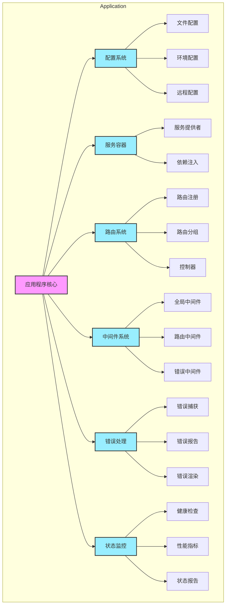
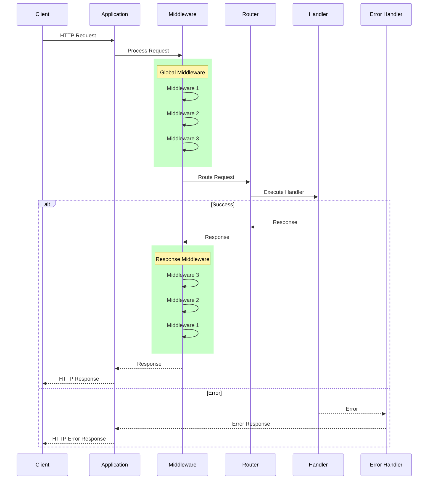
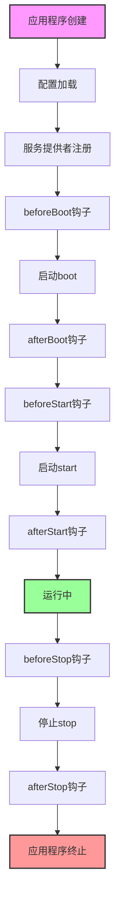

# 应用程序接口设计

## 设计目标

应用程序接口是框架的核心，负责整合各个组件并提供统一的应用程序生命周期管理。设计目标包括：

1. 提供统一的应用程序入口
2. 管理应用程序生命周期
3. 集成各个核心组件
4. 提供优雅的启动和关闭机制
5. 支持插件化扩展

## 组件关系

应用程序由多个核心组件组成，它们之间的关系如下：



主要组件说明：

1. **配置系统**：负责管理应用程序配置，支持多种配置源
2. **服务容器**：提供依赖注入和服务管理功能
3. **路由系统**：处理HTTP请求路由和控制器管理
4. **中间件系统**：提供请求处理管道和中间件管理
5. **错误处理**：统一的错误捕获、处理和报告
6. **状态监控**：应用程序状态和性能监控

## 请求处理流程

应用程序处理HTTP请求的完整流程如下：



处理流程说明：

1. **请求接收**：应用程序接收客户端的HTTP请求
2. **中间件处理**：
   - 请求首先经过全局中间件
   - 中间件按注册顺序正向执行
   - 可以修改请求或提前返回响应
3. **路由匹配**：
   - 根据请求路径和方法匹配路由
   - 执行路由级别的中间件
4. **处理器执行**：
   - 执行匹配到的路由处理器
   - 处理器可以是控制器方法或闭包
5. **响应处理**：
   - 响应经过中间件反向处理
   - 可以修改响应内容
6. **错误处理**：
   - 捕获整个过程中的错误
   - 转换为适当的错误响应
   - 支持自定义错误处理

## 应用程序生命周期

应用程序的生命周期包含多个阶段，每个阶段都有对应的钩子函数：



每个阶段的职责：

1. **应用程序创建**：实例化应用程序，初始化基本配置
2. **配置加载**：加载各种配置源的配置信息
3. **服务提供者注册**：注册并初始化服务提供者
4. **启动(boot)**：初始化核心服务和组件
5. **启动(start)**：启动HTTP服务器，开始处理请求
6. **运行中**：正常处理请求的状态
7. **停止(stop)**：优雅关闭，清理资源

## 核心接口

### 1. 应用程序接口

在 `src/core/interfaces.ts` 中定义应用程序接口：

```typescript
/**
 * 应用程序接口
 */
export interface ApplicationInterface {
    // 生命周期管理
    boot(): Promise<void>;
    start(port?: number): Promise<void>;
    stop(): Promise<void>;
    isRunning(): boolean;

    // 配置管理
    configure(callback: (app: ApplicationInterface) => void): this;
    config<T>(key: string, value?: T): T;

    // 服务管理
    register(provider: IServiceProvider): this;
    resolve<T>(token: string | symbol): T;
    singleton<T>(token: string | symbol, implementation: Constructor<T>): this;
    bind<T>(token: string | symbol, implementation: Constructor<T>): this;

    // 路由管理
    get(path: string, handler: MiddlewareHandler): IRoute;
    post(path: string, handler: MiddlewareHandler): IRoute;
    put(path: string, handler: MiddlewareHandler): IRoute;
    patch(path: string, handler: MiddlewareHandler): IRoute;
    delete(path: string, handler: MiddlewareHandler): IRoute;
    group(prefix: string | RouteGroupOptions, callback: (router: IRouteManager) => void): void;

    // 中间件管理
    use(middleware: MiddlewareHandler): this;
    useGlobal(middleware: MiddlewareHandler): this;

    // 请求处理
    handle(request: RequestInterface): Promise<ResponseInterface>;
    handleHttp(req: any, res: any): Promise<void>;

    // 状态管理
    getPort(): number | undefined;
    getEnvironment(): string;
    getVersion(): string;
}

/**
 * 应用程序配置接口
 */
export interface ApplicationConfig {
    // 基本配置
    name?: string;
    version?: string;
    debug?: boolean;

    // 服务器配置
    port?: number;
    host?: string;

    // 环境配置
    env?: string;
    timezone?: string;
    locale?: string;

    // 组件配置
    providers?: Constructor<IServiceProvider>[];
    middleware?: MiddlewareHandler[];
    plugins?: ApplicationPlugin[];
}

/**
 * 生命周期钩子接口
 */
export interface ApplicationLifecycleHooks {
    // 启动阶段
    beforeBoot?: () => Awaitable<void>;
    afterBoot?: () => Awaitable<void>;

    // 运行阶段
    beforeStart?: () => Awaitable<void>;
    afterStart?: () => Awaitable<void>;

    // 停止阶段
    beforeStop?: () => Awaitable<void>;
    afterStop?: () => Awaitable<void>;
}

/**
 * 插件接口
 */
export interface ApplicationPlugin {
    // 插件信息
    getName(): string;
    getVersion(): string;

    // 生命周期
    install(app: ApplicationInterface): void | Promise<void>;
    uninstall?(app: ApplicationInterface): void | Promise<void>;

    // 配置
    getDefaults?(): Record<string, any>;
    validate?(config: Record<string, any>): boolean;
}

/**
 * 路由组选项
 */
export interface RouteGroupOptions {
    prefix: string;
    middleware?: MiddlewareHandler[];
}

type Awaitable<T> = T | Promise<T>;
```

### 2. 应用程序状态

在 `src/core/constants.ts` 中定义状态枚举：

```typescript
/**
 * 应用程序状态枚举
 */
export enum ApplicationStatus {
    /**
     * 初始化状态
     */
    INIT = 'init',

    /**
     * 启动中
     */
    BOOTING = 'booting',

    /**
     * 已启动
     */
    BOOTED = 'booted',

    /**
     * 运行中
     */
    RUNNING = 'running',

    /**
     * 停止中
     */
    STOPPING = 'stopping',

    /**
     * 已停止
     */
    STOPPED = 'stopped'
}

/**
 * 应用程序环境枚举
 */
export enum ApplicationEnvironment {
    /**
     * 开发环境
     */
    DEVELOPMENT = 'development',

    /**
     * 测试环境
     */
    TEST = 'test',

    /**
     * 生产环境
     */
    PRODUCTION = 'production'
}
```

### 3. 应用程序状态类型

在 `src/core/types.ts` 中定义状态相关类型：

```typescript
/**
 * 应用程序状态信息
 */
export interface ApplicationStatus {
    running: boolean;
    uptime: number;
    memory: NodeJS.MemoryUsage;
    cpu: NodeJS.CpuUsage;
}

/**
 * 应用程序指标
 */
export interface ApplicationMetrics {
    requests: {
        total: number;
        active: number;
        errors: number;
    };
    response: {
        avg: number;
        min: number;
        max: number;
    };
}

/**
 * 健康检查函数
 */
export type HealthCheck = () => Promise<boolean>;

/**
 * 健康检查结果
 */
export type HealthCheckResult = Record<string, boolean>;

/**
 * 状态变更回调
 */
export type StatusChangeCallback = (status: ApplicationStatus) => void;
```

## 使用示例

### 1. 基本应用程序

```typescript
// 创建应用
const app = new Application({
    name: 'My App',
    port: 3000,
    debug: true
});

// 配置应用
app.configure(app => {
    app.use(cors());
    app.use(bodyParser());
    
    app.get('/', () => 'Hello World');
});

// 启动应用
await app.boot();
await app.start();
```

### 2. 使用插件

```typescript
class LoggerPlugin implements ApplicationPlugin {
    getName() {
        return 'logger';
    }
    
    getVersion() {
        return '1.0.0';
    }
    
    install(app: ApplicationInterface) {
        app.singleton('logger', Logger);
        app.useGlobal(loggerMiddleware);
    }
    
    getDefaults() {
        return {
            level: 'info',
            file: 'app.log'
        };
    }
}

// 使用插件
app.configure(app => {
    const plugin = new LoggerPlugin();
    plugin.install(app);
});
```

## 设计原则

### 1. 一致性
- 统一的接口设计
- 一致的生命周期
- 标准的错误处理

### 2. 可扩展性
- 插件系统
- 服务提供者
- 中间件机制

### 3. 可靠性
- 优雅启动
- 优雅关闭
- 错误恢复

### 4. 可维护性
- 模块化设计
- 清晰的职责
- 完整的文档

## 注意事项

1. **生命周期管理**
   - 正确的启动顺序
   - 优雅的关闭处理
   - 资源清理

2. **错误处理**
   - 全局错误捕获
   - 错误分类处理
   - 错误恢复机制

3. **性能优化**
   - 启动时间优化
   - 资源使用监控
   - 性能指标收集

## 下一步

完成了框架的接口设计后，我们将：

1. 开始实现各个组件
2. 编写单元测试
3. 创建示例应用

请继续阅读 [11-design-summary.md](./11-design-summary.md) 来了解设计总结。 
