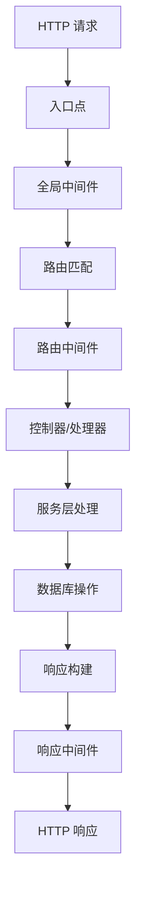
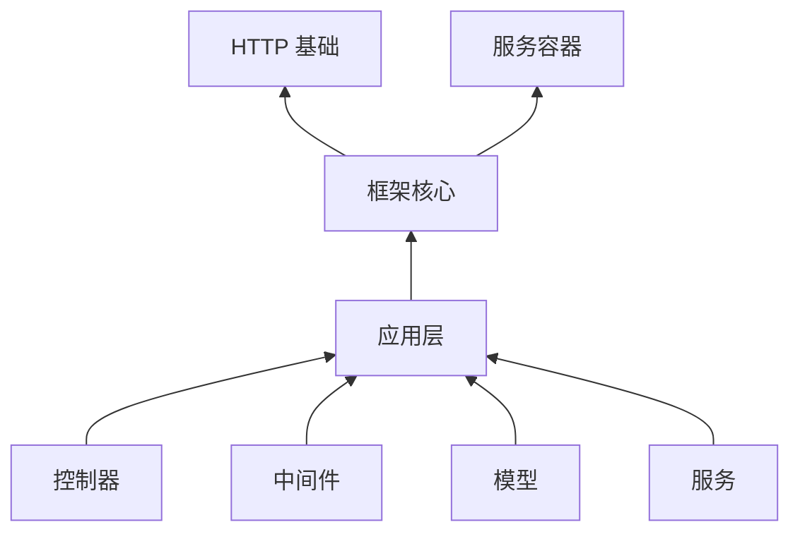

# 步骤 01.0：框架概述

## 框架简介

Cosy Framework 是一个基于 TypeScript 的现代 Web 框架，它借鉴了 Laravel 的优秀设计理念，并结合了 TypeScript 的类型系统优势。框架提供了完整的 Web 应用开发解决方案，包括路由、中间件、依赖注入、ORM 等核心功能。

## 框架特性

- **类型安全**: 基于 TypeScript，提供完整的类型定义和类型推导
- **依赖注入**: 强大的服务容器和依赖注入系统
- **中间件系统**: 灵活的洋葱模型中间件
- **路由系统**: 支持 RESTful 和动态路由
- **数据库集成**: 内置 ORM 和迁移工具
- **模块化**: 高度模块化的设计，支持插件扩展

## 核心组件

### 1. 服务容器 (Container)
- 依赖注入的核心
- 服务生命周期管理
- 服务提供者机制

### 2. HTTP 基础 (HTTP Foundation)
- 请求/响应对象抽象
- Cookie 和 Session 管理
- 文件上传处理

### 3. 路由系统 (Routing)
- 路由注册和分发
- 路由组和前缀
- 路由中间件

### 4. 中间件系统 (Middleware)
- 请求处理管道
- 全局和路由中间件
- 中间件优先级

### 5. 配置系统 (Config)
- 环境配置管理
- 配置缓存
- 动态配置

### 6. 数据库访问 (Database)
- 查询构建器
- 模型和关系
- 迁移和填充

## 请求生命周期



### 详细流程

1. **请求接收**
   - 接收 HTTP 请求
   - 创建请求上下文
   - 初始化基础服务

2. **中间件处理**
   - 执行全局中间件
   - 处理跨域、认证等
   - 预处理请求数据

3. **路由处理**
   - 匹配路由规则
   - 加载路由中间件
   - 准备路由参数

4. **控制器处理**
   - 依赖注入解析
   - 执行控制器方法
   - 处理业务逻辑

5. **响应返回**
   - 构建响应对象
   - 执行响应中间件
   - 发送 HTTP 响应

## 框架分层



### 分层说明

1. **HTTP 基础层**
   - 处理原始 HTTP 请求/响应
   - 提供基础抽象
   - 管理协议相关功能

2. **框架核心层**
   - 提供核心服务
   - 管理应用生命周期
   - 协调各个组件

3. **应用层**
   - 业务逻辑实现
   - 控制器和路由定义
   - 自定义服务

## 设计原则

1. **依赖注入**
   - 松耦合设计
   - 可测试性
   - 可扩展性

2. **中间件模式**
   - 可组合的请求处理
   - 关注点分离
   - 灵活的扩展点

3. **服务提供者**
   - 模块化服务注册
   - 启动和关闭钩子
   - 配置和引导

## 扩展机制

1. **服务提供者**
```typescript
class CustomServiceProvider extends ServiceProvider {
  register() {
    // 注册服务
  }

  async boot() {
    // 启动时执行
  }
}
```

2. **中间件**
```typescript
class CustomMiddleware implements MiddlewareInterface {
  async handle(request: Request, next: NextFunction) {
    // 前置处理
    await next()
    // 后置处理
  }
}
```

3. **装饰器**
```typescript
@Controller('/api')
class ApiController {
  @Get('/users')
  async getUsers() {
    // 处理请求
  }
}
```

## 完成标志
- [ ] 理解框架的整体架构
- [ ] 掌握核心组件的功能和职责
- [ ] 理解请求生命周期
- [ ] 了解框架的扩展机制

## 下一步
完成此步骤后，继续执行 [01.1-project-structure.md](./01.1-project-structure.md)。
