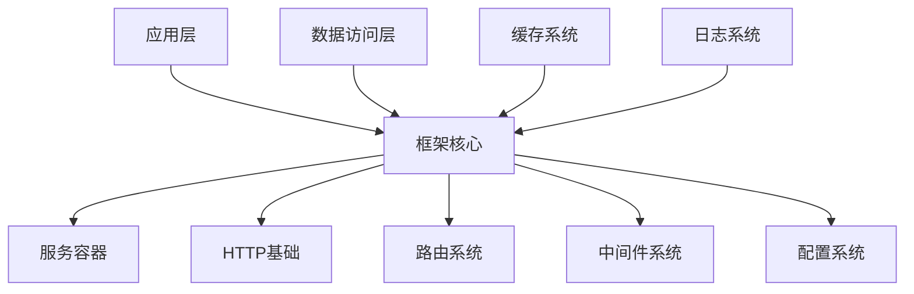
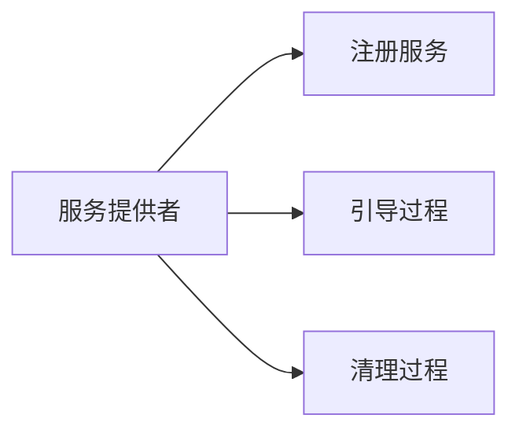
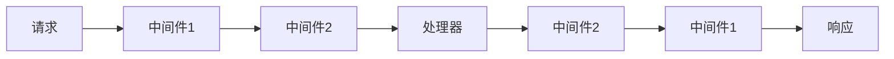
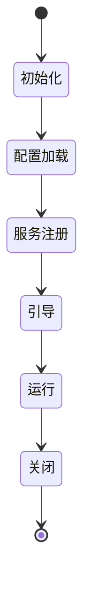

# Cosy Framework 架构设计

## 设计目标

Cosy Framework 旨在提供一个现代化的、类型安全的 Web 应用开发框架，具有以下设计目标：

1. **类型安全**：利用 TypeScript 的类型系统提供完整的类型检查和智能提示
2. **可测试性**：通过依赖注入和接口设计确保代码的可测试性
3. **可扩展性**：提供清晰的扩展点和插件机制
4. **开发体验**：提供优秀的开发者体验和调试能力
5. **性能优化**：在设计层面考虑性能优化空间

## 核心原则

1. **接口优先**：所有核心功能都基于接口定义，实现可替换
2. **依赖注入**：使用依赖注入实现松耦合设计
3. **中间件模式**：采用洋葱模型的中间件系统
4. **装饰器驱动**：利用装饰器提供声明式的API
5. **约定优于配置**：提供合理的默认值，但保持可配置性

## 系统架构

## 核心组件

### 1. 服务容器 (Container)
- 依赖注入的核心实现
- 服务生命周期管理
- 服务提供者机制

### 2. HTTP 基础 (HTTP Foundation)
- 请求/响应抽象
- 中间件管道
- 上下文管理

### 3. 路由系统 (Router)
- 路由注册和分发
- 参数解析
- 路由组

### 4. 中间件系统 (Middleware)
- 中间件链构建
- 错误处理
- 上下文传递

### 5. 配置系统 (Config)
- 环境配置
- 配置提供者
- 动态配置

## 扩展机制

### 1. 服务提供者

### 2. 中间件

### 3. 装饰器
- 控制器装饰器
- 路由装饰器
- 注入装饰器
- 生命周期装饰器

## 接口设计原则

1. **接口隔离**：每个接口只声明必要的方法
2. **依赖倒置**：依赖抽象而不是具体实现
3. **单一职责**：每个组件只负责一个功能领域
4. **开闭原则**：通过扩展而不是修改来添加功能

## 生命周期管理

## 类型系统

1. **泛型约束**：利用泛型提供类型安全
2. **类型推导**：最大化利用 TypeScript 的类型推导
3. **类型守卫**：提供运行时类型检查
4. **映射类型**：使用高级类型特性

## 错误处理

1. **错误分层**：
   - 框架错误
   - 应用错误
   - HTTP 错误
   - 业务错误

2. **错误传播**：
   - 错误中间件
   - 全局错误处理
   - 错误日志

## 安全设计

1. **输入验证**：请求数据验证机制
2. **CSRF 防护**：跨站请求伪造防护
3. **XSS 防护**：跨站脚本攻击防护
4. **认证授权**：可扩展的认证授权系统

## 性能考虑

1. **延迟加载**：按需加载服务和模块
2. **缓存优化**：多层缓存策略
3. **连接池**：数据库和服务连接池
4. **资源管理**：自动资源释放

## 下一步

完成架构概述后，我们将详细设计每个核心组件的接口。请继续阅读以下文档：

1. [核心概念](./01-core-concepts/01.1-dependency-injection.md)
2. [接口定义](./02-interfaces/02.1-container.md)
3. [组件交互](./03-component-interaction.md) 
