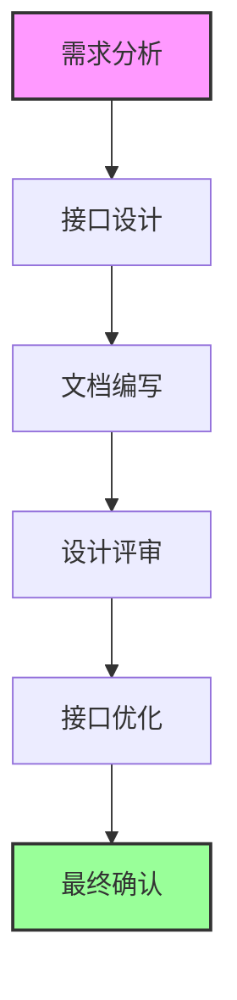

# Phase 1 - Interface Design: 框架接口设计阶段

## 概述

在这个阶段，我们将设计框架的核心接口。这些接口定义了框架的基础架构和组件交互方式，为后续的实现阶段奠定基础。

## 设计章节

1. [核心概念](./01-core-concepts/)
   - 依赖注入
   - 中间件系统
   - 路由系统
   - 生命周期管理

2. [接口定义](./02-interfaces/)
   - 服务容器接口
   - HTTP基础接口
   - 路由接口
   - 中间件接口
   - 配置接口
   - 应用程序接口

## 设计原则

1. **接口分离**
   - 每个接口专注于单一职责
   - 避免接口之间的紧耦合
   - 提供清晰的扩展点

2. **类型安全**
   - 完整的TypeScript类型定义
   - 编译时类型检查
   - 类型推导支持

3. **开发体验**
   - 流畅的API设计
   - 完整的类型提示
   - 合理的默认值

4. **可扩展性**
   - 插件系统
   - 中间件机制
   - 自定义实现

## 设计流程

## 文档规范

1. **接口文档**
   - 设计目标
   - 接口定义
   - 使用示例
   - 注意事项

2. **概念文档**
   - 核心原理
   - 设计考虑
   - 最佳实践
   - 常见问题

3. **图表说明**
   - 组件关系
   - 数据流程
   - 生命周期
   - 状态转换

## 注意事项

1. **接口稳定性**
   - 慎重考虑接口设计
   - 预留扩展空间
   - 避免破坏性变更

2. **实现考虑**
   - 考虑实现的可行性
   - 评估性能影响
   - 权衡设计选择

3. **文档完整性**
   - 详细的接口说明
   - 完整的使用示例
   - 清晰的设计原理

## 下一步

完成接口设计后，我们将进入[实现阶段](../phase2-implementation/)。在实现阶段，我们将：

1. 按照接口规范实现各个组件
2. 编写完整的单元测试
3. 创建示例应用
4. 完善使用文档

请继续阅读[核心概念](./01-core-concepts/)部分。 
