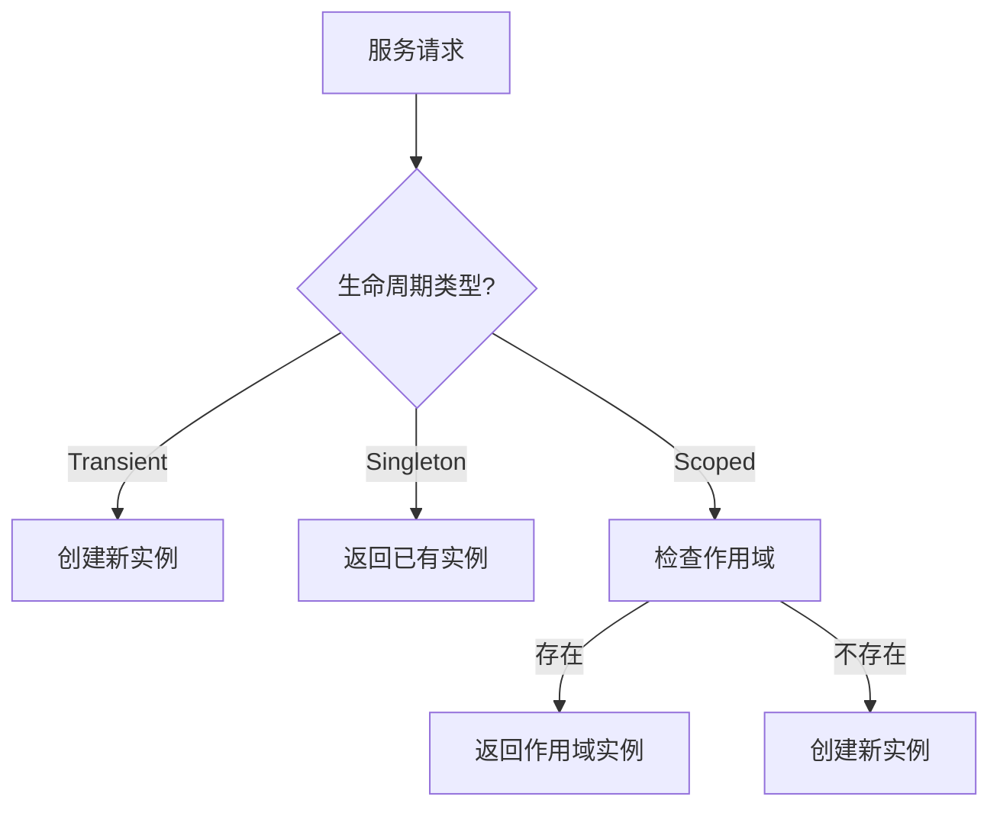
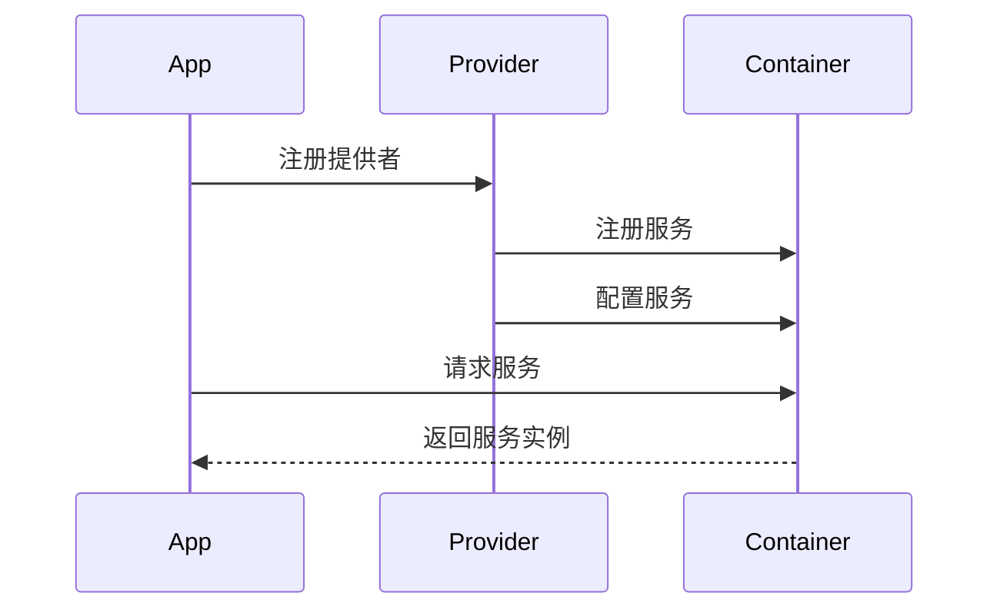

# 依赖注入核心概念

## 概述

依赖注入（DI）是 Cosy Framework 的核心特性之一，它通过控制反转（IoC）模式来实现组件之间的松耦合。

## 核心概念

### 1. 服务标识符 (Token)

服务标识符用于唯一标识一个服务，可以是：
- 字符串
- Symbol
- 类引用

```typescript
// 示例
type Token = string | symbol | Constructor
```

### 2. 服务生命周期

服务实例的生命周期类型：
- **瞬态 (Transient)**: 每次解析都创建新实例
- **单例 (Singleton)**: 在容器中只有一个实例
- **作用域 (Scoped)**: 在特定作用域内共享实例



### 3. 依赖关系

服务之间的依赖关系通过以下方式声明：
- 构造函数注入
- 属性注入
- 方法注入

```typescript
// 构造函数注入
class UserService {
  constructor(
    @Inject() private db: Database,
    @Inject('CONFIG') private config: Config
  ) {}
}

// 属性注入
class AuthService {
  @Inject()
  private userService!: UserService;
}
```

### 4. 服务提供者

服务提供者负责：
- 服务注册
- 服务配置
- 生命周期管理



## 设计原则

### 1. 显式依赖

- 依赖关系应该是显式的
- 通过接口声明依赖
- 避免隐式依赖

### 2. 单一职责

- 每个服务应该只有一个职责
- 避免服务之间的紧耦合
- 保持服务的独立性

### 3. 依赖倒置

- 依赖抽象而不是具体实现
- 使用接口定义契约
- 实现可以被替换

### 4. 开闭原则

- 对扩展开放
- 对修改关闭
- 通过扩展添加新功能

## 最佳实践

### 1. 接口设计

```typescript
// 定义服务接口
interface UserService {
  findById(id: number): Promise<User>;
  create(data: UserData): Promise<User>;
  update(id: number, data: UserData): Promise<User>;
  delete(id: number): Promise<void>;
}

// 实现服务接口
@Injectable()
class UserServiceImpl implements UserService {
  // 实现方法
}
```

### 2. 生命周期管理

```typescript
// 服务提供者
class DatabaseProvider extends ServiceProvider {
  register(container: Container): void {
    // 注册服务
  }

  async boot(): Promise<void> {
    // 初始化
  }

  async shutdown(): Promise<void> {
    // 清理资源
  }
}
```

### 3. 作用域管理

```typescript
// 请求作用域服务
@Injectable({ scope: 'request' })
class RequestScopedService {
  // 服务实现
}

// 单例服务
@Injectable({ scope: 'singleton' })
class SingletonService {
  // 服务实现
}
```

## 注意事项

1. **循环依赖**
   - 避免创建循环依赖
   - 使用接口打破循环
   - 考虑重构设计

2. **资源管理**
   - 正确释放资源
   - 实现清理接口
   - 处理异常情况

3. **性能考虑**
   - 合理使用单例
   - 避免过度注入
   - 控制依赖树深度

## 下一步

理解了依赖注入的核心概念后，我们将：

1. 学习中间件系统的核心概念
2. 了解路由系统的设计理念
3. 掌握配置系统的使用方法

请继续阅读 [01.2-middleware.md](./01.2-middleware.md) 了解中间件系统的核心概念。 
