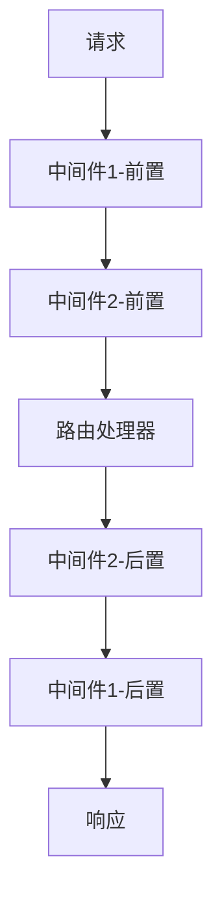
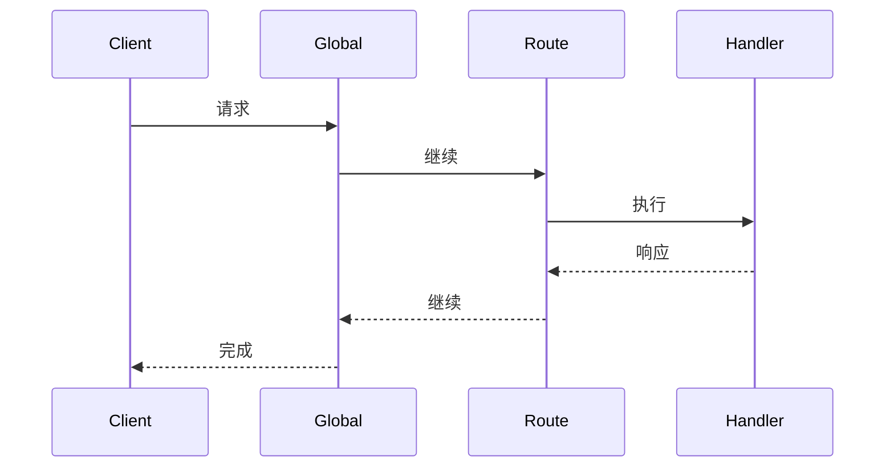

# 中间件系统核心概念

## 概述

中间件系统是 Cosy Framework 的核心功能之一，它基于洋葱模型（Onion Model）实现了强大的请求处理管道。中间件可以在请求到达路由处理器之前和之后执行自定义逻辑。

## 核心概念

### 1. 洋葱模型

中间件的执行遵循洋葱模型，即：
- 请求按照中间件注册顺序从外到内执行
- 响应按照中间件注册顺序从内到外执行



### 2. 中间件类型

1. **全局中间件**
   - 应用于所有请求
   - 最先执行
   - 适用于通用功能

2. **路由中间件**
   - 应用于特定路由
   - 在全局中间件之后执行
   - 可以访问路由参数

3. **错误处理中间件**
   - 捕获并处理错误
   - 统一错误响应格式
   - 错误日志记录

### 3. 执行顺序



## 中间件接口

```typescript
interface MiddlewareInterface {
  handle(context: Context, next: NextFunction): Promise<void>;
}

type NextFunction = () => Promise<void>;
```

## 使用场景

### 1. 认证授权

```typescript
class AuthMiddleware implements MiddlewareInterface {
  async handle(context: Context, next: NextFunction): Promise<void> {
    // 验证 token
    const token = context.request.headers.get('Authorization');
    if (!token) {
      throw new UnauthorizedError();
    }
    
    // 验证通过，继续处理
    await next();
  }
}
```

### 2. 请求日志

```typescript
class LoggerMiddleware implements MiddlewareInterface {
  async handle(context: Context, next: NextFunction): Promise<void> {
    const start = Date.now();
    
    try {
      // 继续处理请求
      await next();
      
      // 记录成功的请求
      const duration = Date.now() - start;
      logger.info({
        method: context.request.method,
        path: context.request.path,
        status: context.response.status,
        duration
      });
    } catch (error) {
      // 记录失败的请求
      logger.error({
        method: context.request.method,
        path: context.request.path,
        error: error.message
      });
      throw error;
    }
  }
}
```

### 3. 错误处理

```typescript
class ErrorHandlerMiddleware implements MiddlewareInterface {
  async handle(context: Context, next: NextFunction): Promise<void> {
    try {
      await next();
    } catch (error) {
      context.response.status(500).json({
        error: error.message,
        stack: process.env.NODE_ENV === 'development' ? error.stack : undefined
      });
    }
  }
}
```

## 设计原则

### 1. 单一职责

- 每个中间件只处理一个特定功能
- 保持中间件的简单性
- 便于测试和维护

### 2. 可组合性

- 中间件可以自由组合
- 顺序要合理安排
- 避免职责重叠

### 3. 错误处理

- 统一的错误处理策略
- 错误信息规范化
- 适当的错误传播

### 4. 性能考虑

- 避免阻塞操作
- 合理使用异步
- 控制中间件数量

## 最佳实践

### 1. 中间件注册

```typescript
// 全局中间件
app.use(new LoggerMiddleware());
app.use(new AuthMiddleware());

// 路由中间件
router.use('/admin', new AdminAuthMiddleware());
```

### 2. 中间件组合

```typescript
// 中间件组
const apiMiddleware = [
  new CorsMiddleware(),
  new AuthMiddleware(),
  new RateLimitMiddleware()
];

// 应用到路由组
app.group('/api', router => {
  router.middleware(apiMiddleware);
  // 定义路由...
});
```

### 3. 错误处理

```typescript
// 全局错误处理
app.use(new ErrorHandlerMiddleware());

// 自定义错误响应
class ApiErrorHandler implements MiddlewareInterface {
  async handle(context: Context, next: NextFunction): Promise<void> {
    try {
      await next();
    } catch (error) {
      if (error instanceof ApiError) {
        context.response.status(error.status).json({
          code: error.code,
          message: error.message
        });
      } else {
        throw error; // 传递给全局错误处理
      }
    }
  }
}
```

## 注意事项

1. **执行顺序**
   - 合理安排中间件顺序
   - 考虑依赖关系
   - 注意性能影响

2. **异步处理**
   - 正确使用 async/await
   - 处理异步错误
   - 避免回调地狱

3. **资源管理**
   - 及时释放资源
   - 处理连接池
   - 避免内存泄漏

## 下一步

理解了中间件系统的核心概念后，我们将：

1. 学习路由系统的设计理念
2. 了解配置系统的使用方法
3. 掌握应用生命周期管理

请继续阅读 [01.3-routing.md](./01.3-routing.md) 了解路由系统的核心概念。 
