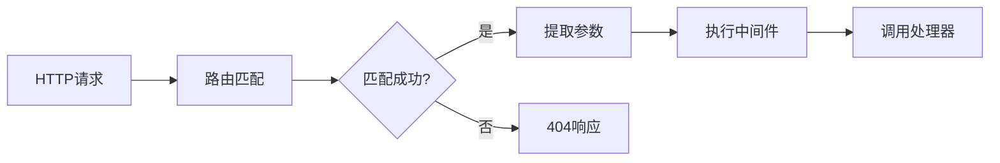
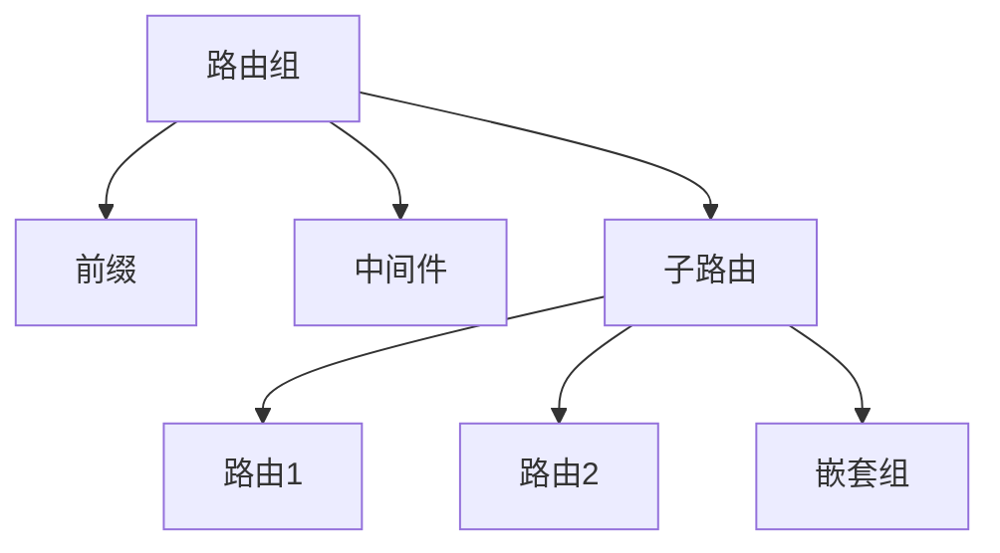

# 路由系统核心概念

## 概述

路由系统负责将 HTTP 请求映射到相应的处理器，是框架的核心组件之一。它提供了灵活的路由定义方式，支持参数提取、路由组和中间件集成。

## 核心概念

### 1. 路由定义

路由定义包含以下要素：
- HTTP 方法
- URL 模式
- 处理器函数
- 中间件（可选）



### 2. 路由参数

支持多种参数类型：
- 路径参数：`/users/{id}`
- 查询参数：`/users?page=1`
- 通配符：`/files/*`
- 可选参数：`/users/{id?}`

### 3. 路由组织



## 路由接口

### 1. 基础路由接口

```typescript
interface RouterInterface {
  // 路由注册
  get(path: string, handler: RouteHandler): RouteInterface;
  post(path: string, handler: RouteHandler): RouteInterface;
  put(path: string, handler: RouteHandler): RouteInterface;
  patch(path: string, handler: RouteHandler): RouteInterface;
  delete(path: string, handler: RouteHandler): RouteInterface;
  
  // 路由组
  group(prefix: string, callback: (router: RouterInterface) => void): void;
  
  // 中间件
  use(middleware: MiddlewareInterface): this;
}

interface RouteInterface {
  // 路由配置
  name(name: string): this;
  middleware(middleware: MiddlewareInterface): this;
  where(constraints: Record<string, RegExp>): this;
}
```

### 2. 路由处理器

```typescript
type RouteHandler = (context: Context) => Promise<any> | any;

interface Context {
  request: RequestInterface;
  response: ResponseInterface;
  params: Record<string, string>;
  query: Record<string, string>;
}
```

## 使用场景

### 1. RESTful API

```typescript
@Controller('/api/users')
class UserController {
  @Get('/')
  async list(context: Context) {
    return this.userService.findAll();
  }

  @Get('/{id}')
  async show(context: Context) {
    const { id } = context.params;
    return this.userService.findById(id);
  }

  @Post('/')
  async create(context: Context) {
    const data = context.request.body;
    return this.userService.create(data);
  }
}
```

### 2. 路由组

```typescript
// API 路由组
router.group('/api', api => {
  // 认证路由组
  api.group('/auth', auth => {
    auth.post('/login', AuthController.login);
    auth.post('/register', AuthController.register);
  });

  // 用户路由组
  api.group('/users', users => {
    users.get('/', UserController.list);
    users.post('/', UserController.create);
    users.get('/{id}', UserController.show);
  });
});
```

### 3. 参数约束

```typescript
router
  .get('/users/{id}', UserController.show)
  .where({ id: /^\d+$/ });

router
  .get('/posts/{slug}', PostController.show)
  .where({ slug: /^[a-z0-9-]+$/ });
```

## 设计原则

### 1. 声明式路由

- 使用装饰器定义路由
- 支持控制器类
- 自动参数注入

### 2. 灵活性

- 支持多种注册方式
- 可扩展的路由系统
- 自定义参数处理

### 3. 类型安全

- 完整的类型定义
- 参数类型推导
- 响应类型检查

### 4. 性能优化

- 高效的路由匹配
- 参数缓存
- 路由编译

## 最佳实践

### 1. 路由组织

```typescript
// 按功能模块组织
router.group('/api', api => {
  // 用户模块
  api.group('/users', UserRoutes);
  
  // 文章模块
  api.group('/posts', PostRoutes);
  
  // 评论模块
  api.group('/comments', CommentRoutes);
});

// 版本控制
router.group('/api/v1', v1Router);
router.group('/api/v2', v2Router);
```

### 2. 错误处理

```typescript
@Controller('/api/users')
class UserController {
  @Get('/{id}')
  async show(context: Context) {
    const user = await this.userService.findById(context.params.id);
    if (!user) {
      throw new NotFoundError('User not found');
    }
    return user;
  }
}
```

### 3. 参数验证

```typescript
@Controller('/api/users')
class UserController {
  @Post('/')
  @Validate(createUserSchema)
  async create(context: Context) {
    const data = context.request.body;
    return this.userService.create(data);
  }
}
```

## 注意事项

1. **路由顺序**
   - 具体路由先于通配符
   - 正确处理冲突
   - 合理使用参数约束

2. **安全考虑**
   - 参数验证
   - 路由保护
   - 访问控制

3. **性能优化**
   - 路由缓存
   - 参数预处理
   - 避免过深嵌套

## 下一步

理解了路由系统的核心概念后，我们将：

1. 学习生命周期管理
2. 了解配置系统
3. 掌握应用程序结构

请继续阅读 [01.4-lifecycle.md](./01.4-lifecycle.md) 了解生命周期管理的核心概念。 
