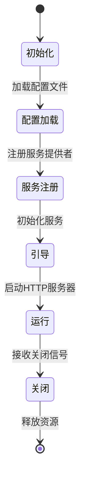
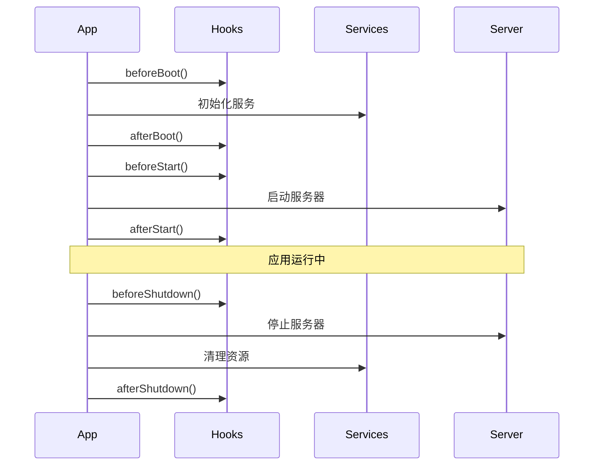

# 生命周期管理核心概念

## 概述

生命周期管理是框架的核心特性之一，它定义了应用程序从启动到关闭的完整过程，包括服务初始化、资源管理和优雅关闭等关键阶段。

## 核心概念

### 1. 生命周期阶段



1. **初始化阶段**
   - 创建应用实例
   - 设置基本配置
   - 准备核心服务

2. **配置加载阶段**
   - 加载环境变量
   - 读取配置文件
   - 合并配置项

3. **服务注册阶段**
   - 注册服务提供者
   - 绑定核心服务
   - 配置服务参数

4. **引导阶段**
   - 初始化服务
   - 建立连接
   - 准备资源

5. **运行阶段**
   - 启动 HTTP 服务器
   - 处理请求
   - 监控系统状态

6. **关闭阶段**
   - 停止接收新请求
   - 完成进行中的请求
   - 释放资源

### 2. 生命周期钩子

```typescript
interface LifecycleHooks {
  // 引导阶段钩子
  beforeBoot(): Promise<void>;
  afterBoot(): Promise<void>;
  
  // 启动阶段钩子
  beforeStart(): Promise<void>;
  afterStart(): Promise<void>;
  
  // 关闭阶段钩子
  beforeShutdown(): Promise<void>;
  afterShutdown(): Promise<void>;
}
```

### 3. 生命周期事件



## 生命周期接口

### 1. 应用程序接口

```typescript
interface ApplicationInterface {
  // 生命周期控制
  boot(): Promise<void>;
  start(): Promise<void>;
  shutdown(): Promise<void>;
  
  // 状态查询
  isBooted(): boolean;
  isRunning(): boolean;
  
  // 钩子注册
  setHooks(hooks: Partial<LifecycleHooks>): this;
}
```

### 2. 服务提供者接口

```typescript
interface ServiceProvider {
  // 注册服务
  register(container: Container): void;
  
  // 生命周期钩子
  boot?(): Promise<void>;
  shutdown?(): Promise<void>;
}
```

## 使用场景

### 1. 数据库连接管理

```typescript
class DatabaseProvider extends ServiceProvider {
  async boot(): Promise<void> {
    // 建立数据库连接
    await this.db.connect();
    
    // 运行迁移
    await this.db.migrate();
    
    // 初始化连接池
    await this.db.initPool();
  }
  
  async shutdown(): Promise<void> {
    // 等待活动查询完成
    await this.db.waitForQueries();
    
    // 关闭连接池
    await this.db.closePool();
    
    // 断开连接
    await this.db.disconnect();
  }
}
```

### 2. 缓存服务管理

```typescript
class CacheProvider extends ServiceProvider {
  async boot(): Promise<void> {
    // 连接缓存服务器
    await this.cache.connect();
    
    // 清理过期数据
    await this.cache.cleanup();
    
    // 预热缓存
    await this.cache.warmup();
  }
  
  async shutdown(): Promise<void> {
    // 持久化数据
    await this.cache.persist();
    
    // 关闭连接
    await this.cache.disconnect();
  }
}
```

### 3. 定时任务管理

```typescript
class SchedulerProvider extends ServiceProvider {
  async boot(): Promise<void> {
    // 初始化调度器
    await this.scheduler.init();
    
    // 加载任务配置
    await this.scheduler.loadJobs();
    
    // 启动调度
    await this.scheduler.start();
  }
  
  async shutdown(): Promise<void> {
    // 停止接收新任务
    await this.scheduler.pause();
    
    // 等待运行中的任务完成
    await this.scheduler.waitForRunningJobs();
    
    // 停止调度器
    await this.scheduler.stop();
  }
}
```

## 设计原则

### 1. 可靠性

- 确保资源正确初始化
- 保证资源正确释放
- 处理异常情况

### 2. 优雅关闭

- 停止接收新请求
- 等待活动请求完成
- 按顺序关闭服务

### 3. 可扩展性

- 支持自定义钩子
- 灵活的事件系统
- 可配置的超时机制

### 4. 可观测性

- 生命周期事件日志
- 状态监控
- 健康检查

## 最佳实践

### 1. 应用启动

```typescript
class Application {
  async boot(): Promise<void> {
    try {
      // 触发启动前钩子
      await this.hooks.beforeBoot();
      
      // 加载配置
      await this.loadConfig();
      
      // 注册服务
      await this.registerServices();
      
      // 初始化服务
      await this.bootServices();
      
      // 触发启动后钩子
      await this.hooks.afterBoot();
    } catch (error) {
      this.logger.error('启动失败', error);
      throw error;
    }
  }
}
```

### 2. 优雅关闭

```typescript
class Application {
  async shutdown(): Promise<void> {
    try {
      // 触发关闭前钩子
      await this.hooks.beforeShutdown();
      
      // 停止接收新请求
      this.server.close();
      
      // 等待活动请求完成
      await this.waitForRequests();
      
      // 关闭服务
      await this.shutdownServices();
      
      // 触发关闭后钩子
      await this.hooks.afterShutdown();
    } catch (error) {
      this.logger.error('关闭失败', error);
      process.exit(1);
    }
  }
}
```

### 3. 信号处理

```typescript
class Application {
  setupSignalHandlers(): void {
    // 处理终止信号
    process.on('SIGTERM', () => {
      this.shutdown();
    });
    
    // 处理中断信号
    process.on('SIGINT', () => {
      this.shutdown();
    });
    
    // 处理致命错误
    process.on('uncaughtException', (error) => {
      this.logger.error('致命错误', error);
      this.shutdown();
    });
  }
}
```

## 注意事项

1. **超时处理**
   - 设置合理的超时时间
   - 处理超时情况
   - 强制关闭机制

2. **错误处理**
   - 启动失败处理
   - 关闭失败处理
   - 异常恢复机制

3. **资源管理**
   - 资源初始化顺序
   - 资源释放顺序
   - 防止资源泄漏

## 下一步

理解了生命周期管理的核心概念后，我们将：

1. 了解配置系统的设计
2. 学习应用程序结构
3. 掌握错误处理机制

请继续阅读 [02-interfaces/02.1-container.md](../02-interfaces/02.1-container.md) 了解接口设计。 
