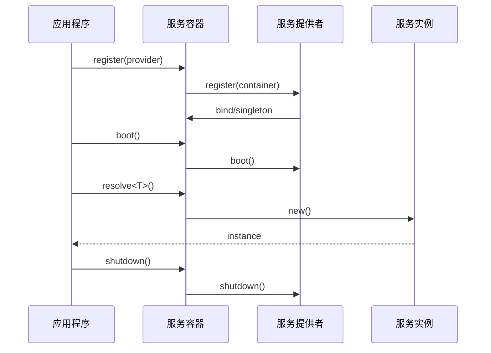

# 服务容器接口设计

## 设计目标

服务容器是框架的核心组件，负责依赖注入和服务生命周期管理。它的设计目标是：

1. 提供类型安全的依赖注入
2. 支持服务生命周期管理
3. 实现可扩展的服务提供者机制
4. 支持循环依赖检测
5. 提供声明式的服务注册

## 核心接口

### 1. 容器接口

```typescript
export interface ContainerInterface {
  // 服务绑定
  bind<T>(token: Token, implementation: Constructor<T>): this
  singleton<T>(token: Token, implementation: Constructor<T>): this
  factory<T>(token: Token, factory: Factory<T>): this
  
  // 服务解析
  resolve<T>(token: Token): T
  resolveAll<T>(tokens: Token[]): T[]
  
  // 服务管理
  has(token: Token): boolean
  remove(token: Token): boolean
  clear(): void
  
  // 服务提供者
  register(provider: ServiceProvider): this
  boot(): Promise<void>
  shutdown(): Promise<void>
}
```

### 2. 服务提供者接口

```typescript
export interface ServiceProvider {
  // 注册服务
  register(container: ContainerInterface): void
  
  // 生命周期钩子
  boot?(): Promise<void>
  shutdown?(): Promise<void>
}
```

### 3. 装饰器接口

```typescript
export interface InjectMetadata {
  token: Token
  optional?: boolean
}

export interface ServiceMetadata {
  token?: Token
  singleton?: boolean
  dependencies?: Token[]
}
```

### 4. 工具类型

```typescript
// 基础类型
export type Constructor<T = any> = new (...args: any[]) => T
export type Token = string | symbol | Constructor
export type Factory<T = any> = (...args: any[]) => T

// 服务定义
export interface ServiceDefinition<T = any> {
  token: Token
  factory: Factory<T>
  singleton?: boolean
  dependencies?: Token[]
}
```

## 接口交互



## 使用示例

### 1. 基础服务注册

```typescript
interface UserService {
  getUser(id: number): Promise<User>
}

@Injectable()
class UserServiceImpl implements UserService {
  constructor(
    @Inject() private db: Database,
    @Inject('CONFIG') private config: Config
  ) {}

  async getUser(id: number): Promise<User> {
    return this.db.findUser(id)
  }
}

// 注册服务
container.singleton<UserService>('UserService', UserServiceImpl)
```

### 2. 服务提供者

```typescript
class DatabaseProvider extends ServiceProvider {
  register(container: ContainerInterface): void {
    container.singleton('Database', DatabaseImpl)
  }

  async boot(): Promise<void> {
    // 初始化数据库连接
  }

  async shutdown(): Promise<void> {
    // 关闭数据库连接
  }
}
```

### 3. 装饰器使用

```typescript
@Injectable()
class AuthService {
  @Inject()
  private userService!: UserService

  @Inject('CONFIG')
  private config!: Config
}
```

## 错误处理

```typescript
// 服务未找到错误
export class ServiceNotFoundError extends Error {
  constructor(token: Token) {
    super(`Service not found: ${String(token)}`)
  }
}

// 循环依赖错误
export class CircularDependencyError extends Error {
  constructor(tokens: Token[]) {
    super(`Circular dependency detected: ${tokens.map(String).join(' -> ')}`)
  }
}
```

## 扩展点

1. **自定义解析器**：
   - 支持自定义服务解析逻辑
   - 支持特殊类型的依赖注入

2. **生命周期扩展**：
   - 添加自定义生命周期钩子
   - 支持异步初始化

3. **作用域管理**：
   - 请求作用域服务
   - 会话作用域服务

## 实现考虑

1. **性能优化**：
   - 服务实例缓存
   - 依赖图优化
   - 延迟初始化

2. **内存管理**：
   - 自动清理未使用的服务
   - 防止内存泄漏
   - 资源释放保证

3. **并发处理**：
   - 线程安全的服务解析
   - 异步服务初始化
   - 并发请求处理

## 下一步

完成服务容器接口设计后，我们将：

1. 设计 HTTP 基础接口
2. 设计路由系统接口
3. 设计中间件系统接口

请继续阅读 [02.2-http.md](./02.2-http.md) 了解 HTTP 基础接口设计。 
