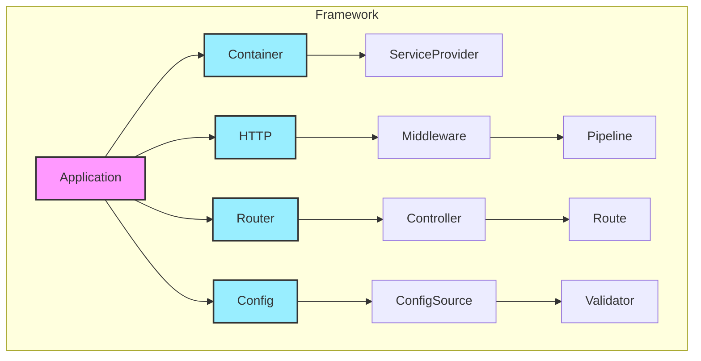

# 接口设计总结

## 概述

在这一阶段，我们完成了框架的核心接口设计。这些接口定义了框架的基础架构和组件交互方式，为后续的实现阶段奠定了基础。

## 已完成的接口设计

1. **服务容器接口** (02.1-container.md)
   - 依赖注入系统
   - 服务生命周期管理
   - 服务提供者机制

2. **HTTP基础接口** (02.2-http.md)
   - 请求/响应抽象
   - HTTP消息接口
   - 会话管理

3. **路由系统接口** (02.3-routing.md)
   - 路由注册和匹配
   - 路由组和前缀
   - 路由参数处理

4. **中间件系统接口** (02.4-middleware.md)
   - 中间件管道
   - 中间件组
   - 错误处理中间件

5. **配置系统接口** (02.5-config.md)
   - 配置管理器
   - 配置源抽象
   - 配置验证器

6. **应用程序接口** (02.6-application.md)
   - 生命周期管理
   - 组件集成
   - 插件系统

## 设计特点

### 1. 模块化设计
- 每个组件都有清晰的职责
- 组件之间通过接口交互
- 支持自定义实现

### 2. 可扩展性
- 插件系统
- 中间件机制
- 服务提供者

### 3. 类型安全
- TypeScript接口定义
- 泛型支持
- 编译时类型检查

### 4. 开发体验
- 流畅的API设计
- 装饰器支持
- 完整的类型提示

## 接口关系

## 最佳实践

### 1. 接口设计原则
- 保持接口简单明确
- 遵循单一职责原则
- 支持依赖注入
- 提供类型安全

### 2. 扩展性考虑
- 预留扩展点
- 支持自定义行为
- 避免硬编码依赖

### 3. 性能优化
- 延迟加载
- 缓存支持
- 资源复用

### 4. 错误处理
- 统一的错误处理机制
- 错误分类和转换
- 错误恢复策略

## 下一步工作

1. **实现阶段准备**
   - 创建项目结构
   - 设置开发环境
   - 选择依赖包

2. **核心实现**
   - 按优先级实现各个组件
   - 编写单元测试
   - 进行集成测试

3. **文档编写**
   - API文档
   - 使用指南
   - 示例代码

4. **示例应用**
   - 创建示例项目
   - 展示最佳实践
   - 验证设计合理性

## 注意事项

1. **接口稳定性**
   - 接口一旦发布就要保持稳定
   - 做好版本控制
   - 提供向后兼容

2. **实现灵活性**
   - 支持不同的实现方式
   - 预留定制化空间
   - 避免过度设计

3. **文档完整性**
   - 详细的接口说明
   - 完整的使用示例
   - 清晰的最佳实践

## 结论

通过这个阶段的接口设计，我们：

1. 定义了框架的核心架构
2. 设计了组件间的交互方式
3. 确保了框架的可扩展性
4. 提供了类型安全的保证
5. 为实现阶段做好了准备

接下来，我们将进入框架的实现阶段，请继续阅读 `phase2/` 目录下的文档。 
