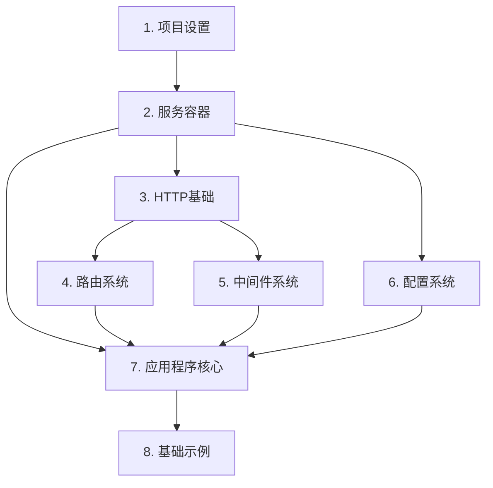

# Phase 2 - Implementation: 框架实现阶段

## 概述

在完成了[接口设计阶段](../phase1-interface-design/)后，我们进入实现阶段。这个阶段将把设计的接口转化为实际的代码实现。

## 实现章节

1. [项目设置](./01-project-setup/)
   - 项目结构
   - 基础文件
   - 测试设置
   - 构建验证
   - Reflect Metadata

2. [服务容器](./02-service-container/)
   - 类型定义
   - 容器实现
   - 装饰器实现
   - 服务提供者
   - 测试实现

3. [HTTP基础](./03-http-foundation/)
   - HTTP类型
   - 请求实现
   - 响应实现
   - 上下文实现
   - 辅助函数
   - 测试实现

4. [路由系统](./04-routing-system/)
   - 路由注册
   - 路由匹配
   - 路由组
   - 控制器
   - 中间件集成

5. [中间件系统](./05-middleware-system/)
   - 中间件管道
   - 中间件组
   - 错误处理
   - 内置中间件

6. [配置系统](./06-configuration-system/)
   - 配置管理器
   - 配置源
   - 配置验证
   - 环境配置

7. [应用程序核心](./07-application-core/)
   - 类型定义
   - 核心实现
   - 启动器实现
   - 装饰器实现
   - 测试实现

8. [基础示例](./08-basic-example/)
   - 项目结构
   - 应用设置
   - API实现
   - 服务实现
   - 测试文档

## 实现顺序

实现顺序按照组件的依赖关系排列：

## 实现原则

1. **渐进式开发**
   - 从核心组件开始
   - 逐步添加功能
   - 持续进行测试

2. **测试驱动**
   - 先写测试
   - 再做实现
   - 保证覆盖率

3. **文档同步**
   - 代码注释完整
   - 更新API文档
   - 添加使用示例

4. **质量控制**
   - 代码审查
   - 性能测试
   - 安全检查

## 开发工具

- TypeScript
- Jest
- ESLint
- Prettier
- Husky
- Commitlint

## 注意事项

1. **代码质量**
   - 遵循TypeScript最佳实践
   - 保持代码简洁清晰
   - 注重性能优化

2. **向后兼容**
   - 遵循语义化版本
   - 保持API稳定
   - 提供迁移指南

3. **错误处理**
   - 合理的错误分类
   - 清晰的错误信息
   - 完整的错误处理

4. **性能考虑**
   - 避免不必要的依赖
   - 优化关键路径
   - 合理使用缓存

## 下一步

请按顺序阅读和实现每个章节。从[项目设置](./01-project-setup/)开始。 
