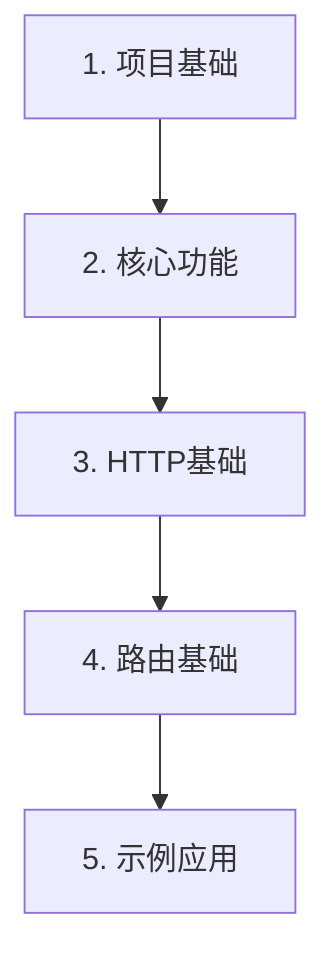

# Phase 2 - MVP: 最小可用版本实现

## 概述

在完成[接口设计阶段](../phase1-interface-design/)后，我们需要快速验证设计的可行性。这个阶段将实现一个最小可用版本(MVP)，以验证核心概念并为完整实现提供基础。

## 实现目标

1. 验证接口设计的可行性
2. 快速获得可运行的框架版本
3. 收集早期反馈以指导后续完整实现
4. 建立基本的开发模式和测试方法

## 实现步骤

1. [项目基础](./01-project-setup.md)
   - 最小项目结构
   - 基本依赖配置
   - 简单构建流程

2. [核心功能](./02-core-basic.md)
   - 简化的应用类
   - 基本服务容器
   - 错误处理

3. [HTTP基础](./03-http-basic.md)
   - 简单HTTP服务器
   - 基本请求处理
   - 响应生成

4. [路由基础](./04-routing-basic.md)
   - 路由注册
   - 简单路由匹配
   - 控制器支持

5. [示例应用](./05-example-basic.md)
   - Todo API示例
   - 基本CRUD操作
   - 简单中间件使用

## 实现顺序



## 实现原则

1. **保持简单**
   - 只实现必要的功能
   - 避免过度设计
   - 关注核心流程

2. **快速迭代**
   - 优先实现可运行的版本
   - 及时验证和调整
   - 收集使用反馈

3. **代码质量**
   - 基本测试覆盖
   - 清晰的注释
   - 符合接口设计

4. **文档同步**
   - 记录关键决策
   - 更新使用说明
   - 标注待改进点

## 最终产物

完成所有步骤后，你将得到：

```
packages/cosy-framework-mvp/
├── package.json
├── tsconfig.json
└── src/
    ├── core/
    │   └── application.ts
    ├── http/
    │   └── server.ts
    ├── routing/
    │   └── router.ts
    └── index.ts
```

## 下一步

从[项目基础](./01-project-setup.md)开始，逐步构建我们的MVP版本。记住，这个阶段的重点是验证设计并快速得到可用的结果，而不是追求完美的实现。 
