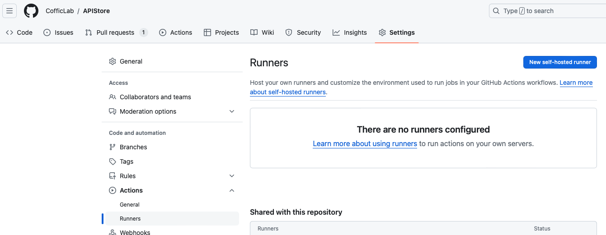

This article is still in the draft stage, so its content may change.

## GitHub

git clone https://gitclone.com/github.com/xxx

## GitHub Actions

### whai is GitHub Actions

GitHub Actions is a continuous integration and delivery (CI/CD) tool.

### Install GitHub Actions on Ubuntu

First, open the settings page of your project, as shown in the following picture.

### Write a workflow file

GitHub Actions is a powerful feature that enables developers to automate various tasks within their GitHub repositories. It offers a seamless way to build, test, deploy, and perform many other operations directly from the GitHub platform.

One of the key benefits of GitHub Actions is its flexibility. You can define custom workflows based on your specific project needs. For example, you can set up an action to automatically run tests whenever code is pushed to a specific branch. This ensures that potential issues are caught early in the development process.

To get started with GitHub Actions, you first need to create a workflow file in the&nbsp;.github/workflows&nbsp;directory of your repository. The workflow file is written in YAML format and specifies the steps and jobs that need to be executed.

Let's take a look at a simple example of a workflow that builds and deploys a Node.js application.

name: Build and Deploy

on:
push:
branches: - main

jobs:
build:
runs-on: ubuntu-latest
steps: - uses: actions/checkout@v2 - name: Install dependencies
run: npm install - name: Build the application
run: npm run build

deploy:
needs: build
runs-on: ubuntu-latest
steps: - name: Deploy to Server
uses: appleboy/scp-action@master
with:
host: ${{ secrets.SERVER_HOST }}
username: ${{ secrets.SERVER_USERNAME }}
password: ${{ secrets.SERVER_PASSWORD }}
local_path: 'dist/\*\*'
remote_path: '/var/www/html'
In this example, the workflow is triggered whenever code is pushed to the&nbsp;main&nbsp;branch. The&nbsp;build&nbsp;job installs dependencies and builds the application, and the&nbsp;deploy&nbsp;job deploys the built files to a remote server.

GitHub Actions also integrates well with other services and tools. You can use it to trigger notifications, update documentation, and much more.

In conclusion, GitHub Actions is a game-changer for developers, providing an efficient and customizable way to automate repetitive tasks and streamline the development process. It helps teams focus on writing code and delivering high-quality software.

### References

https://docs.github.com/en/actions/hosting-your-own-runners/managing-self-hosted-runners/adding-self-hosted-runners

https://github.com/features/actions

## GitLab CI

Some users may prefer to use GitLab over GitHub.

But we won’t delve into that here.

## Jenkins

Some users may prefer to use Jenkins over GitHub.

But we won’t delve into that here.
