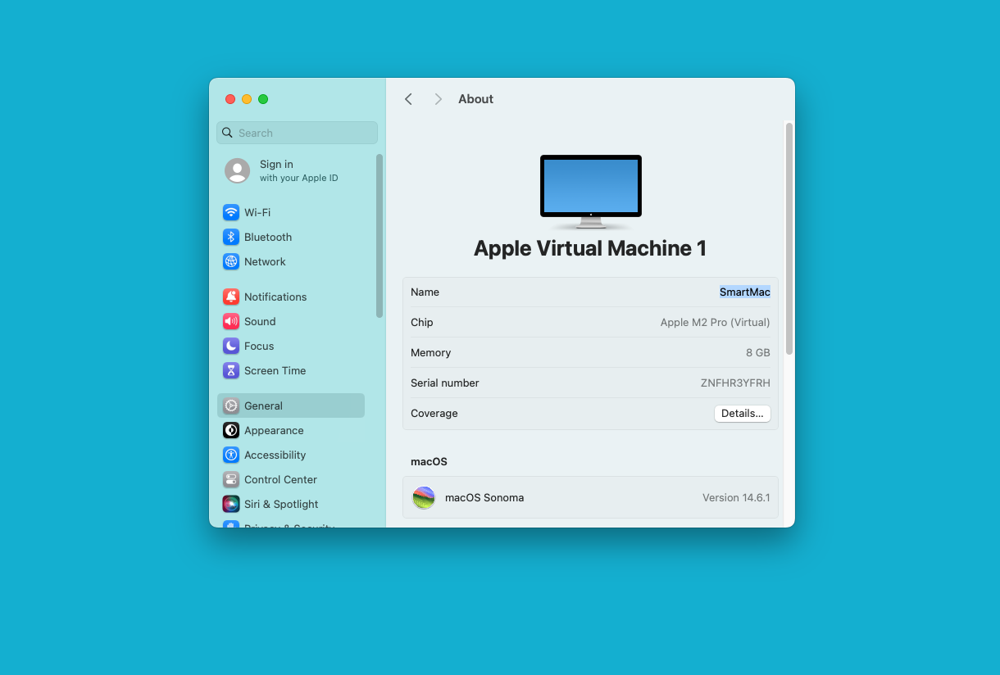
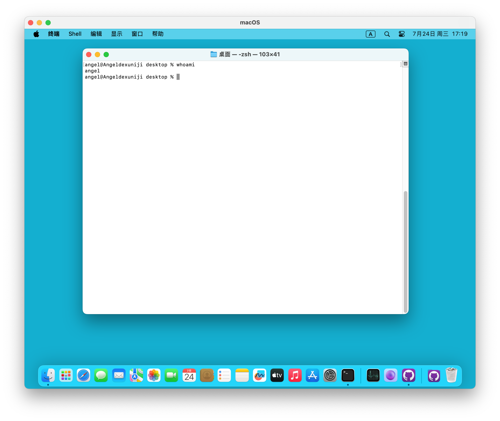

## 架构

现在你有了一台电脑，你是如何操作它的呢？

当然是通过各种应用程序。

这些应用程序是如何操作电脑的呢？

这些应用程序实际上是通过命令来操作电脑的。

### 向终端应用打招呼

每个 macOS 用户都有一个终端应用。这是我们的最强大的工具。你可以通过终端应用来操作所有的命令。

我建议你将终端应用固定到 Dock，因为你将来会经常使用它。

这里的文字是什么意思？

Last login: ...

表示上次登录的时间。

angel@Angeldexuniji...

表示：用户名@机器名

你可以在这里设置你喜欢的机器名：

## 主题

在设置页面，有许多可用的主题，你可以选择一个你喜欢的。

## 用法

### whoami

macOS 操作系统支持多个用户。

你当前登录的是哪个用户？

输入这个命令：

whoami

### pwd

如果你发现字体太小，同时按下这两个键：**Command +**

当前的目录是什么？

输入这个命令：

pwd

### ls

列出当前目录中的所有文件和文件夹：

ls### cd

更改当前目录：

cd ~/Download### rm

删除一个文件

rm temp.txt## Shell

上述提到的命令属于 **shell**，这是一个特殊的用户程序，它提供了一个用户使用操作系统服务的接口。

## 其他命令

还有其他命令吗？

当然有。

当你需要时，只需问你的 AI 助手！

## 安装命令

我们可以安装其他命令吗？

可以！

那么如何安装呢？

我们以后会学习。

## 总结

终端是一个强大的工具，它作为用户和操作系统之间通信的接口。上述提供的示例只是最常见的用例。随着你的学习之旅的继续，你将发现更多的高级用例。

## 参考

https://www.geeksforgeeks.org/introduction-linux-shell-shell-scripting/#what-is-shell
