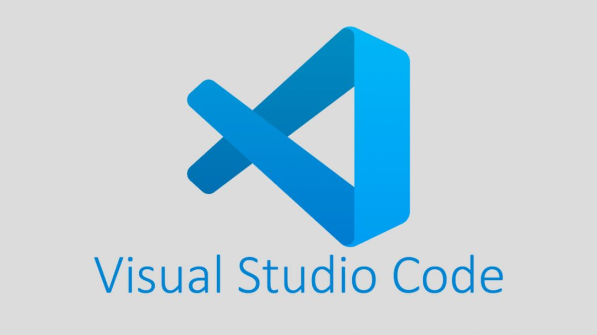
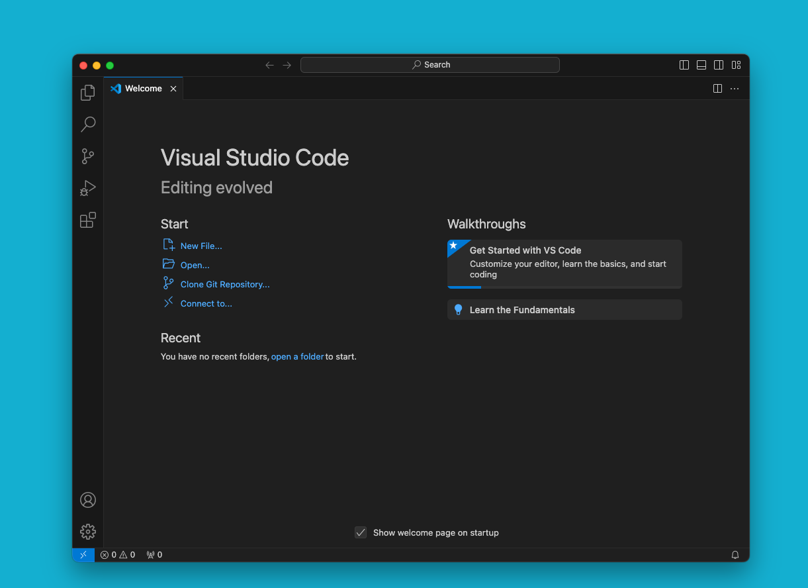

Visual Studio Code（VS Code）是由微软开发的一款流行代码编辑器。

它的代码是开源的，您可以免费使用。

## 工作区

现在，请在适当的位置创建一个新文件夹来存储您的代码，例如：~/Code。

您将来使用的所有代码都将存储在这里。

## 安装 VS Code

访问 Visual Studio Code 网站，下载并安装它。

这就是它的样子：

## 安装 ‘code’ 命令

按下 command + shift + p，输入 ‘shell’，然后点击第一个菜单：

## 基本用法

### 1. 打开文件夹或文件

**打开文件夹**：点击文件 &gt; 打开文件夹... 来打开整个项目文件夹。

**打开文件**：点击文件 &gt; 打开文件... 来打开单个文件。

### 2. 创建新文件

点击文件 &gt; 新建文件，或使用快捷键 Ctrl + N（Windows/Linux）或 Cmd + N（macOS）。

### 3. 编写代码

在编辑器中开始输入您的代码。VS Code 支持多种编程语言的语法高亮。

### 4. 安装扩展

扩展增强了 VS Code 的功能。要安装扩展：

点击窗口侧边活动栏中的扩展视图图标（或按 Ctrl + Shift + X）。

搜索您想要的扩展（例如，Python、JavaScript 等）。

点击所需扩展上的安装。

### 5. 运行代码

您可以直接在终端中运行代码：

通过点击终端 &gt; 新建终端打开终端。

如果需要，使用 cd 命令导航到您的项目文件夹。

使用适当的命令运行您的代码（例如，使用 python filename.py 运行 Python 代码）。

## 第 5 步：自定义 VS Code

您可以根据自己的喜好自定义 VS Code：

**主题**：通过转到文件 &gt; 首选项 &gt; 颜色主题来更改主题。

**设置**：通过点击左下角的齿轮图标并选择设置来访问设置。

## 结论

Visual Studio Code 是一款多功能工具，可以极大地提升您的编码体验。通过遵循本指南，您现在应该对如何安装和使用 VS Code 有了基本的了解。探索其功能，安装有用的扩展，并根据您的工作流程进行自定义。祝您编码愉快！
