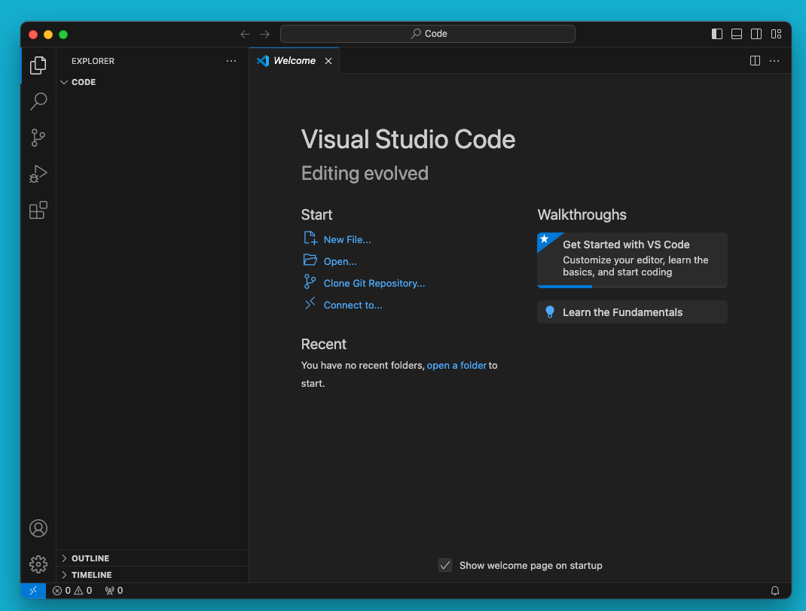
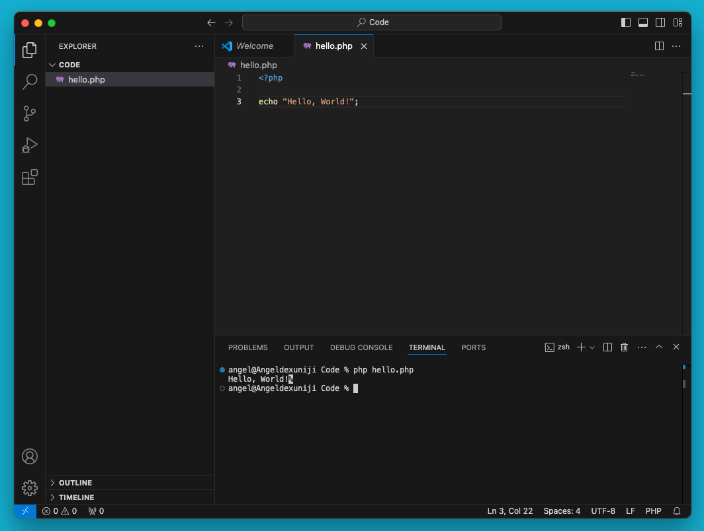

## 介绍

PHP（Hypertext Preprocessor 的缩写）是一种广泛使用的服务器端脚本语言，主要用于网站开发。

PHP 可以执行各种任务，但其主要用途仍然是创建网站。

## 使用 AI 编程

有时你可能会遇到一些简单的问题，比如如何格式化时间，如何连接两个字符串等。别忘了你的 AI 助手，他们特别擅长回答这些问题。

以下是一些优秀的 AI 助手：

https://sider.ai

https://openai.com/chatgpt/mac/

https://monica.im

## 在 macOS 上安装

### 安装 PHP

安装 PHP 的方法有很多，但这里我们选择最常用和最简单的方法：使用 Homebrew 安装。

一旦安装了 Homebrew，你就可以通过运行以下命令来安装 PHP：

brew install php

安装过程结束时，你会看到类似这样的内容：

### 验证安装

要验证 PHP 是否已安装，在终端中运行以下命令：

php -v

这将输出 PHP 版本信息，如下所示：

PHP 8.3.12 (cli) (built: Sep 24 2024 18:08:04) (NTS) Copyright (c) The PHP Group Zend Engine v4.3.12, Copyright (c) Zend Technologies with Zend OPcache v8.3.12, Copyright (c), by Zend Technologies

也许你看到的内容与此不完全相同，但格式是一致的。

## PHP 入门

接下来，你将学习如何运行 PHP 文件。

我的工作空间文件夹是：~/Code，所以我用这个命令打开它：

cd ~/Code && code .

结果如下：

### 创建

打开 Visual Studio Code。编写你的 PHP 代码，例如：

<?php

echo "Hello, World!";

将文件保存为 .php 扩展名，例如 hello.php。

### 运行

点击"新建终端"打开终端：

使用以下命令运行 PHP 文件：

php hello.php

你应该在终端中看到输出 "Hello, World!"。

### 打印时间

按照以下步骤打印时间。

在你的工作空间文件夹中创建一个名为 time.php 的新文件

在文件中写入以下代码：

<?php echo date("Y-m-d H:i:s");

在终端中输入此代码并按回车运行：

php time.php

如果你看到以下输出，恭喜！你已成功打印出时间。

2021-12-31 16:45:09

如果你遇到难以处理的问题，请毫不犹豫地询问你的 AI 助手。

### 函数

在你的工作空间文件夹中创建一个名为 function.php 的新文件。

编写一个函数来打印斐波那契数列。填写缺失的代码。

<?php

echo fibonacci(100);

function fibonacci($n) { // 在这里写你的代码 }

### 数组排序

在你的工作空间文件夹中创建一个名为 array_sorting.php 的新文件。

这是一个将两个数组合并并按升序排序的函数。

填写缺失的代码。

<?php
$a = [1, 2, 5];
$b = [3, 4];

$c = array_merge_and_sort($a, $b);
print_r($c);

function array_merge_and_sort($a, $b) { // 在这里写你的代码 }

数组 c 应该是：[1,2,3,4,5]。

### HTTP 服务器

在你的工作空间文件夹中创建一个名为 http_server.php 的新文件。

使用以下 shell 命令创建一个监听 8000 端口的 HTTP 服务器：

php -S localhost:8000 http_server.php

当用户访问主页时，打印 "Hello World!"。

<?php // 在这里写你的代码

最后，在浏览器中打开链接。

这就是开发网页的基本原理。
