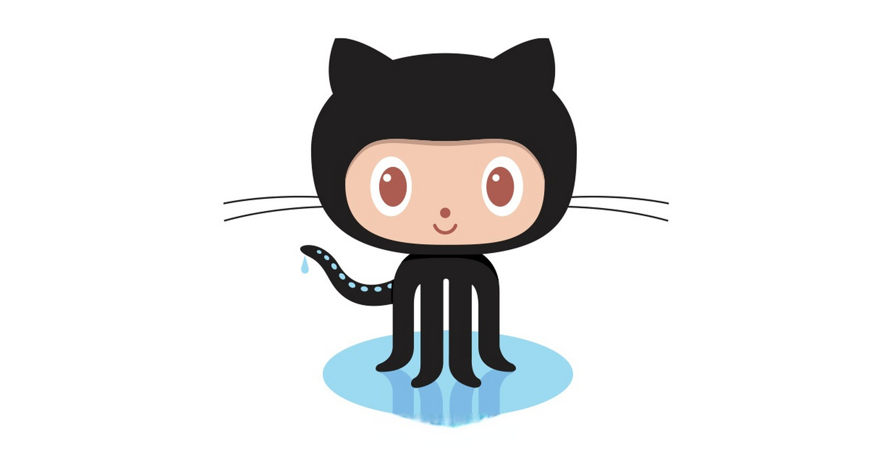

**中国大陆用户可能有时会遇到访问 GitHub 网站的困难，你需要自行寻找解决方案。**

## 什么是 Git 和 GitHub

Git 是一个版本控制系统。它允许你追踪文件的变更，并在需要时恢复到之前的版本。Git 还允许多人同时在同一个项目上工作。

GitHub 是一个基于云的托管服务，让你可以管理和协作处理代码项目。它提供访问控制和多种协作功能，如错误追踪、功能请求、任务管理、持续集成以及每个项目的 wiki。

## 注册 GitHub

请创建一个 GitHub 账号，因为这对接下来的学习是必需的。

注册 GitHub 账号并不难，你应该能自己完成。

## 安装 Git

你可以使用以下命令来安装 Git：

brew install git

安装完成后，在终端应用中输入以下代码并按回车运行。

git -v

如果你看到以下输出，恭喜！你已成功安装了 Git。

git version 2.39.3 (Apple Git-146)

看，很多命令都有 -v 选项。

## 安装 GitHub Desktop

什么是 GitHub Desktop？

GitHub Desktop 是一个免费且开源的 Git 图形用户界面。它为使用 Git 时发生的工作流程提供了可视化表示，包括提交时间线、分支和文件。

简单来说，它可以帮助我们管理代码。

请参考 https://desktop.github.com 获取更多信息。

## 安装 "github" 命令

这个命令非常有用，让我们来安装它。

## 参考资料

https://github.com/apps/desktop

https://git-scm.com
