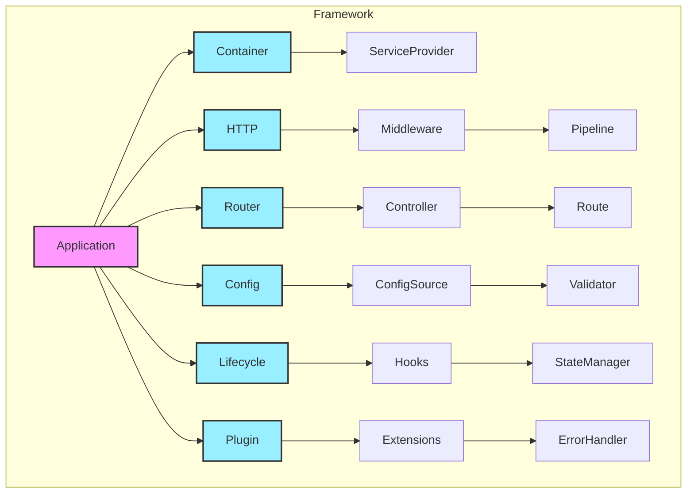

# 接口设计总结

## 概述

在这一阶段，我们完成了框架的核心接口设计。这些接口定义了框架的基础架构和组件交互方式，为后续的实现阶段奠定了基础。

## 已完成的接口设计

1. **依赖注入系统** (02-dependency-injection.md)
   - 服务容器接口
   - 服务生命周期管理
   - 服务提供者机制
   - 装饰器支持

2. **中间件系统** (03-middleware-design.md)
   - 洋葱模型实现
   - 中间件管道
   - 中间件组
   - 错误处理中间件

3. **路由系统** (04-routing-design.md)
   - 路由注册和匹配
   - 路由组和前缀
   - 路由参数处理
   - 路由约束

4. **生命周期系统** (05-lifecycle-design.md)
   - 生命周期钩子
   - 启动和关闭流程
   - 状态管理
   - 资源清理

5. **HTTP基础** (06-http-interface.md)
   - 请求/响应抽象
   - HTTP消息接口
   - 会话管理
   - 文件上传
   - Cookie管理

6. **路由系统扩展** (07-routing-interface.md)
   - 控制器装饰器
   - 路由方法装饰器
   - 路由编译器
   - 参数提取

7. **中间件系统扩展** (08-middleware-interface.md)
   - 中间件上下文
   - 中间件工厂
   - 中间件管理器
   - 错误处理

8. **配置系统** (09-config-interface.md)
   - 配置管理器
   - 配置源抽象
   - 配置验证器
   - 环境配置

9. **应用程序核心** (10-application-interface.md)
   - 生命周期管理
   - 组件集成
   - 插件系统
   - 状态监控
   - 错误处理

## 设计特点

### 1. 模块化设计
- 每个组件都有清晰的职责
- 组件之间通过接口交互
- 支持自定义实现
- 最小化组件间依赖

### 2. 可扩展性
- 插件系统
- 中间件机制
- 服务提供者
- 生命周期钩子

### 3. 类型安全
- TypeScript接口定义
- 泛型支持
- 编译时类型检查
- 完整的类型提示

### 4. 开发体验
- 流畅的API设计
- 装饰器支持
- 统一的错误处理
- 完整的文档支持

## 接口关系

## 最佳实践

### 1. 接口设计原则
- 保持接口简单明确
- 遵循单一职责原则
- 支持依赖注入
- 提供类型安全
- 预留扩展点

### 2. 扩展性考虑
- 插件机制
- 中间件系统
- 生命周期钩子
- 自定义服务提供者
- 配置源扩展

### 3. 性能优化
- 延迟加载
- 缓存支持
- 资源复用
- 优雅启动和关闭
- 内存管理

### 4. 错误处理
- 统一的错误处理机制
- 错误分类和转换
- 错误恢复策略
- 错误日志
- 开发者友好的错误信息

## 下一步工作

1. **实现阶段准备**
   - 创建项目结构
   - 设置开发环境
   - 选择依赖包
   - 制定测试策略

2. **核心实现**
   - 实现依赖注入容器
   - 实现HTTP基础设施
   - 实现路由系统
   - 实现中间件系统
   - 实现配置系统
   - 实现生命周期管理
   - 实现插件系统

3. **文档编写**
   - API文档
   - 使用指南
   - 最佳实践
   - 示例代码
   - 贡献指南

4. **示例应用**
   - 基础示例
   - 完整应用示例
   - 插件示例
   - 测试覆盖
   - 性能基准

## 注意事项

1. **接口稳定性**
   - 遵循语义化版本
   - 提供迁移指南
   - 维护向后兼容
   - 废弃流程管理
   - 版本策略

2. **实现灵活性**
   - 支持多种实现方式
   - 预留定制化空间
   - 避免过度设计
   - 保持简单性
   - 关注点分离

3. **文档完整性**
   - 详细的接口说明
   - 完整的使用示例
   - 清晰的最佳实践
   - 故障排除指南
   - 常见问题解答

## 结论

通过这个阶段的接口设计，我们：

1. 定义了完整的框架架构
2. 设计了清晰的组件交互方式
3. 建立了可扩展的插件系统
4. 实现了统一的错误处理
5. 提供了完整的类型支持
6. 确保了框架的可维护性
7. 为实现阶段做好了准备

接下来，我们将进入框架的实现阶段，请继续阅读 [../phase2-implementation/00-overview.md](../phase2-implementation/00-overview.md) 来开始实现阶段。 
